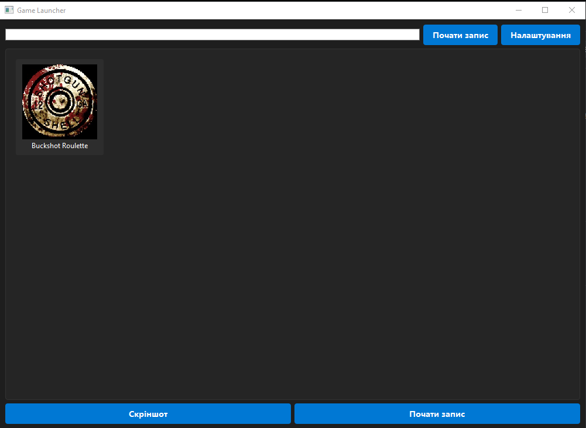

# 🎮 Game Launcher Pro
Привіт , я починаючй програміст , звати мене pilk і це мій 1 із перших проектів , хто хоче зроби якесь заучваєення до проекту то ось telegram - https://t.me/pilkxzz
Сучасний лаунчер ігор з розширеними можливостями запису відео та створення скріншотів. Програма автоматично знаходить встановлені ігри зі Steam та Epic Games, дозволяє записувати геймплей у високій якості та робити скріншоти.




## ✨ Основні можливості

### 🎯 Управління іграми
- Автоматичне виявлення ігор зі Steam та Epic Games
- Зручний пошук по бібліотеці ігор
- Відображення часу гри та іконок
- Швидкий запуск ігор одним кліком

### 🎥 Запис відео
- Підтримка різних кодеків (H264, XVID, MJPG, VP8, VP9)
- Гнучкі налаштування якості та бітрейту
- Підтримка різних роздільних здатностей (до 4K)
- Можливість запису звуку
- Відображення курсору та кліків миші
- Гаряча клавіша F9 для початку/зупинки запису

### 📸 Створення скріншотів
- Підтримка форматів PNG, JPG, BMP
- Налаштування якості зображення
- Автоматичне збереження з часовою міткою

### ⚙️ Налаштування
- Зручний інтерфейс налаштувань
- Збереження всіх налаштувань між сеансами
- Темна тема інтерфейсу
- Можливість налаштування розміру вікна

## 🚀 Встановлення

1. Клонуйте репозиторій:
```bash
git clone https://github.com/yourusername/game-launcher-pro.git
```

2. Встановіть залежності:
```bash
pip install -r requirements.txt
```

3. Запустіть програму:
```bash
python game_launcher.py
```

## 📦 Залежності

- Python 3.8+
- PyQt5 - для графічного інтерфейсу
- OpenCV (cv2) - для запису відео
- NumPy - для обробки зображень
- Pillow - для роботи з зображеннями
- vdf - для парсингу файлів Steam
- psutil - для роботи з процесами
- keyboard - для обробки клавіш

## 🎯 Використання

1. **Запуск гри:**
   - Виберіть гру зі списку
   - Натисніть кнопку "Запустити"

2. **Запис відео:**
   - Натисніть кнопку "Почати запис"
   - Налаштуйте параметри запису
   - Почніть гру
   - Натисніть F9 для зупинки запису

3. **Створення скріншоту:**
   - Натисніть кнопку "Скріншот" під час гри
   - Зображення автоматично збережеться в папку screenshots

4. **Налаштування:**
   - Натисніть кнопку налаштувань
   - Змініть необхідні параметри
   - Налаштування збережуться автоматично

## 🛠️ Технічні деталі

- Програма написана на Python з використанням PyQt5
- Використовує багатопоточність для запису відео
- Підтримує апаратне прискорення GPU
- Автоматично створює необхідні директорії
- Зберігає налаштування в JSON форматі

## 📝 Ліцензія

MIT License - дивіться файл [LICENSE](LICENSE)

## 🤝 Внесок

Будемо раді вашим пропозиціям та покращенням! Створюйте issues та pull requests.
